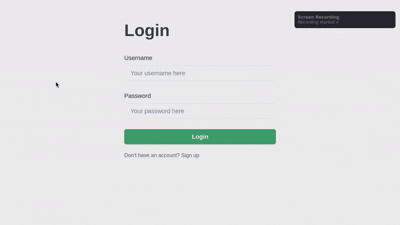
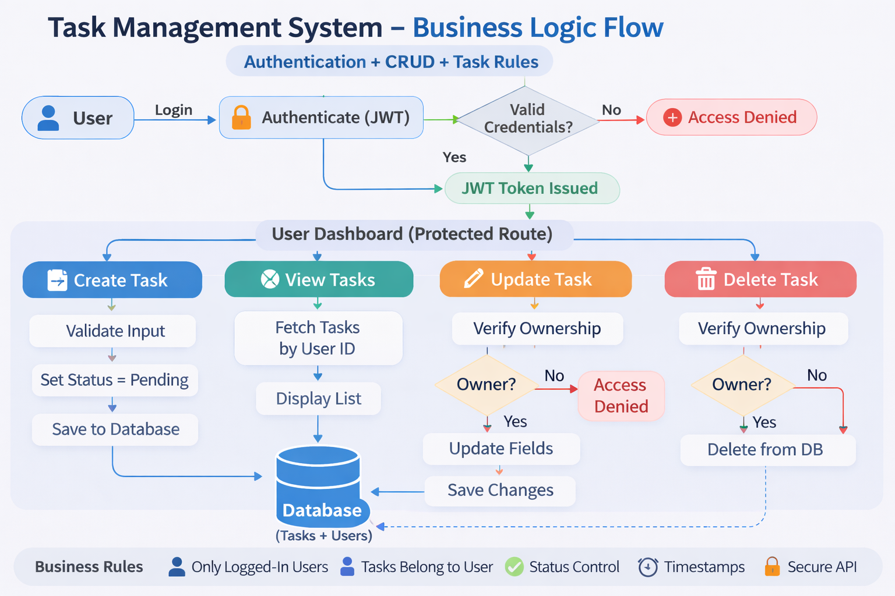

This is a Task Management app built using Django and React JS. It helps to create task, complete and delete task. 

<b>Features:</b>
- CRUD functionality
- Digitization of tasks
- Easy to use  

###### Demo Video


- [REQUIREMENTS](#requirements)
- [INSTALLATION](#installation)
- [WORKFLOW](#workflow)
    - [Models](#models)
    - [Views](#views)
    - [Frontend](#frontend)

## REQUIREMENTS
Following packages are used and required:
- [python](https://www.python.org/)
- [npm](https://nodejs.org/en/download)
- shell (eg: [zsh](https://github.com/zsh-users/zsh), [bash](https://www.gnu.org/software/bash/), or you can use [git bash](https://git-scm.com/install/windows) )
## INSTALLATION
- To Install in your system. First Clone the repository.

```
$ git clone --depth 1 https://github.com/elfak-x9/taskManager.git
```

- GO into the directory taskManager.
```
cd taskManager
```
- Initialize python virtual env to install required packages
```
python -m venv .venv
```
```
source .venv/bin/activate
```
```
pip install -r backend/requirements.txt
```
- Install required node packages
```
cd frontend && npm install
```

- Now initialize the servers Use two shell to start the backend and frontend servers
```
cd ../backend/ 
python manage.py migrate
python manage.py runserver
```
<b>Note:</b> You should be in python venv to run this command.
- For react server
```
cd frontend && npm start
```
<b>Note:</b> You should be inside frontend.

Now you are good to go. See the below for more information.

## WORKFLOW


### Models
Model used in the code: 
``` python
class Task(models.Model):
    user = models.ForeignKey(User, on_delete=models.CASCADE)
    title = models.CharField(max_length=250)
    completed = models.BooleanField(default=False)
    date = models.DateTimeField(auto_now_add=True)
```
### Views
For login view used:
``` python 
class TokenObtainPair(TokenObtainPair):
    ...
    res.set_cookie(
        key="access_token",
        value=access_token,
        httponly=True,
        secure=True,
        samesite='None',
        path='/'
    )
```
similar for the refresh token too.

#### CRUD operation
``` python
class TaskViewSet(viewsets.ModelViewSet):
    serializer_class = TaskSerializer
    permission_classes = [permissions.IsAuthenticated]

    def get_queryset(self):
        return Task.objects.filter(user=self.request.user).order_by('-date')

    def perform_create(self, serializer):
        serializer.save(user=self.request.user)
```
This automatically does the crud operation.

- This is how it works in the backend.

### Frontend
Gets api for CRUD operations of tasks.
``` javascript
export const getTasks = () => API.get("tasks/");
export const createTask = (data) => API.post("tasks/", data);
export const updateTask = (id) => API.patch(`tasks/${id}/`);
export const deleteTask = (id) => API.delete(`tasks/${id}/`);

```
similarly gets other api for login and register too.
